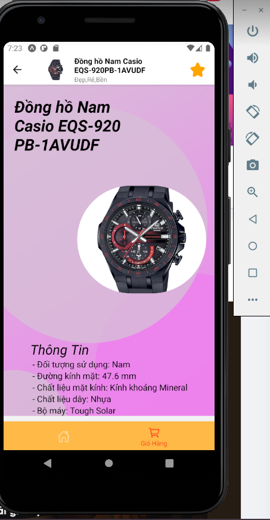

### React Native Expo examples

Learn React Native (Expo CLI) by easy-to-difficult examples.

## Run project in development

- Setting up the development environment: https://reactnative.dev/docs/environment-setup.

- Install dependencies: `yarn install` (or `npm install`).

- Run on Android: `yarn android` (or `npm run android`).

- Run on iOS: `yarn ios` (or `npm run ios`).

- Run on both Android & iOS: `yarn mobile` (or `npm run mobile`).

### ảnh demo
 

## Video demo

To see a demo video, click the screenshot (right). =>
